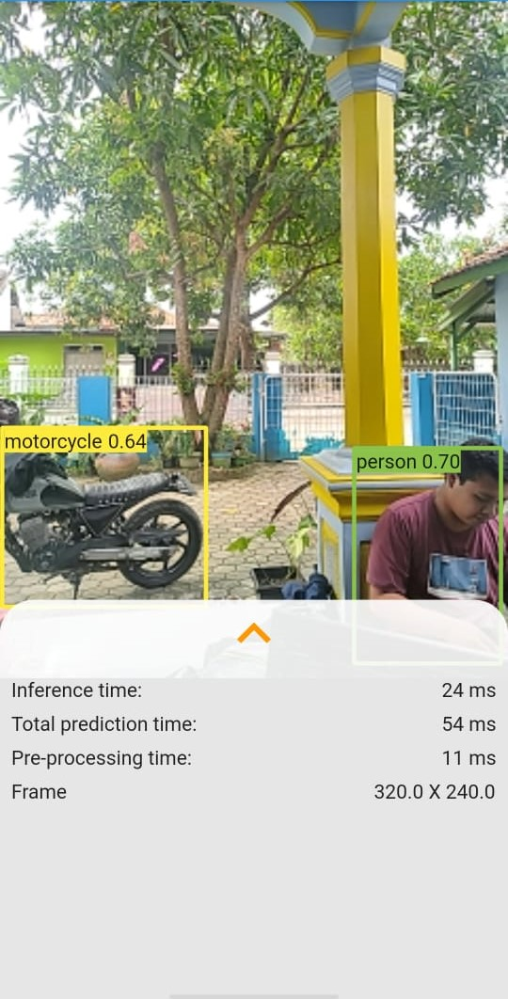
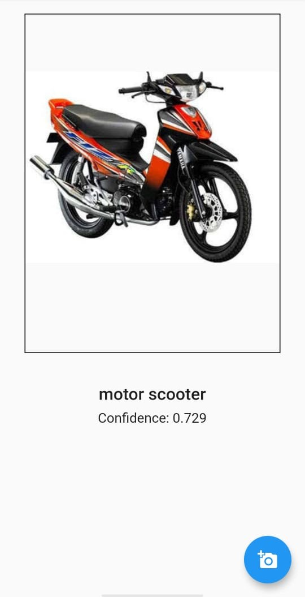

# tensorflow_objectdetection

Aplikasi Flutter menggunakan Library TensorFLow

## Screenshot

### Real Time Detection
Deteksi Gambar menggunakan Camera dan Deteksi nya RealTime

### Image Classification
Deteksi Gambar dari Galery                                 

